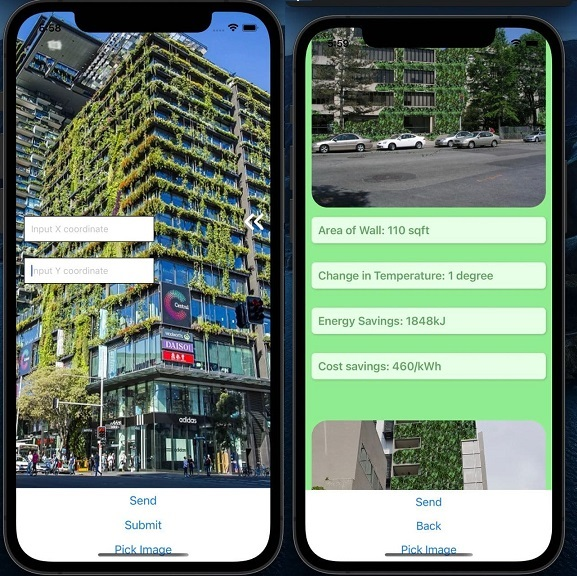
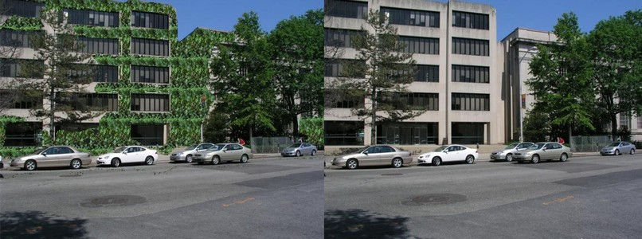
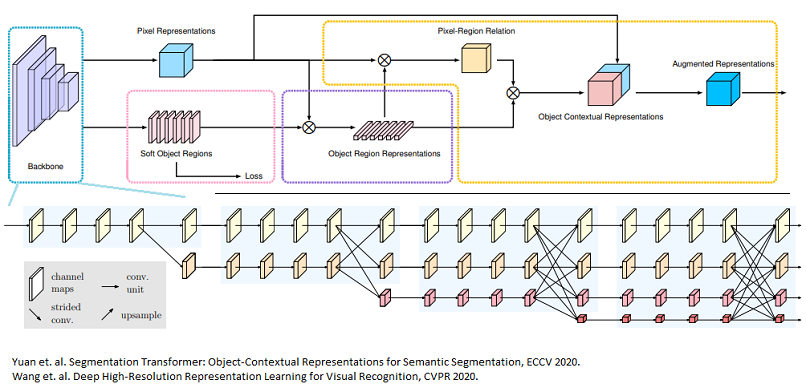

# MLDA_d4ddy

This repo hosts code for bushier. A AI powered solution for sustainable cooling of Singapore for MLDA Hackathon 2021.



### What is bushier?
*bushier* is a visual advisory tool for building owners to identify optimal vertical greenery solutions for energy and cost saving measures through ML visual overlays. Use *bushier* to capture / upload building profiles to our ML models, to obtain optimal overlay of vertical greenery, potential energy and cost savings

* Devpost submission: https://devpost.com/software/cooling-singapore-sustainably
* Video: https://www.youtube.com/watch?v=d7-EybfsT0E

## Other parts of the solution
Segmentation training/serving submodule: https://github.com/rehohoho/mmsegmentation \
Depth-estimation serving submodule: https://github.com/rehohoho/AdaBins

## Setup
### Setup repo
```
git clone https://github.com/bryanongse/dad-s-bush.git
git submodule update --init --recursive
```

### Option 1: Create virtual environment
Note for Windows users: `virtenv\Scripts\activate` to activate environment.
```
python -m venv venv
. venv/Scripts/activate
python -m pip install -U -r requirements.txt
```

### Option 2: Anaconda virtual environment
```
conda create --name daddy python=3.8
conda activate daddy
python -m pip install -U -r requirements.txt
```

## Models
1) Segmentation: [https://drive.google.com/file/d/11o5vOWmofXxB277-ywLIG2EaYMtVRtR_/view?usp=sharing](https://drive.google.com/file/d/11o5vOWmofXxB277-ywLIG2EaYMtVRtR_/view?usp=sharing)
2) Depth-estimation: [https://drive.google.com/drive/folders/1nYyaQXOBjNdUJDsmJpcRpu6oE55aQoLA?usp=sharing](https://drive.google.com/drive/folders/1nYyaQXOBjNdUJDsmJpcRpu6oE55aQoLA?usp=sharing)

## Usage
React-native app hosting
```
cd testApp
npm install
npm start
```

Flask server hosting
```
cd backend
python app.py
```

## Sample results

